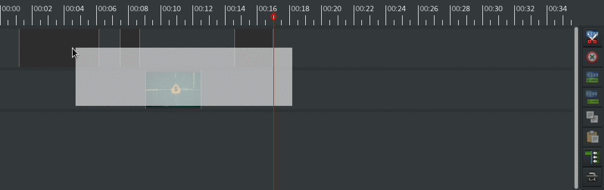

---
short-description: An advanced plugin example
...

# How to interact with the timeline

Let's add a button for removing the gaps between clips!



Follow the steps in the [hello world example](Plugins.md) to create a plugin directory and a plugin info file. What's left is to create the Python module with the logic.

## Adding the new button

Since the button is related to the timeline, we add it in the timeline toolbar, at the right of the timeline.

```python
from gi.repository import GObject
from gi.repository import Gtk
from gi.repository import Peas

class GapRemover(GObject.Object, Peas.Activatable):

    object = GObject.Property(type=GObject.Object)

    def do_activate(self):
        self.app = self.object.app
        self.button = Gtk.ToolButton.new_from_stock(Gtk.STOCK_STRIKETHROUGH)
        self.button.set_tooltip_text("Remove gaps between clips")
        self.button.show()

        toolbar = self.app.gui.editor.timeline_ui.toolbar
        toolbar.add(self.button)
```

At this point, you can re-start Pitivi, activate the plugin and notice the new button in the UI!

## Making it dance

The interesting part is the `__clicked_cb` callback method, which is connected to the button's "clicked" signal:

```python

    def do_activate(self):
        ...
        self.button.connect("clicked", self.__clicked_cb)

    def __clicked_cb(self, unused_button):
        timeline = self.app.gui.editor.timeline_ui.timeline
        clips = sorted(timeline.selection, key=lambda x : x.get_start())
        if len(clips) >= 2:
            previous = clips[0]
            for clip in clips[1:]:
                clip.set_start(previous.get_start() + previous.get_duration())
                previous = clip
```

Finally, we can add some cleanup logic when the plugin is deactivated, because we're nice:

```python
    def do_deactivate(self):
        self.app.gui.editor.timeline_ui.toolbar.remove(self.button)
```

## Making it shine

The plugin can be improved by:
- Associating the action with a keyboard shortcut.
- Checking whether the clips are [grouped](https://www.pitivi.org/manual/selectiongrouping.html), because the entire group moves when a clip in the group is moved, so they should be dealt with somehow.
- Making the operation undoable by wrapping it in a `with self.app.action_log.started("add clip", toplevel=True):`.
- Disabling the button automatically when `timeline.selection` contains less than two clips.
- Making it work for the entire timeline in case there is no selection.

Check out the Pitivi code and the [GES API](http://lazka.github.io/pgi-docs/#GES-1.0) to see what can be done, and tell us what you are hacking!
