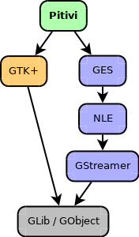

# Architecture

The image on the right should give you a general idea of what
technologies Pitivi depends on.

The Pitivi **user interface** is made using GTK+, a toolkit for creating
graphical user interfaces using widgets and event handling.

The **backend** is made of the following components:

-   [GES](GES.md) (GStreamer Editing Services), a library
    wrapping Non-Linear Engine to offer
    a higher level friendly API for video editing. Non-Linear Engine is
    media-agnostic and has no notions of video editing. Non-Linear
    Engine is basically composed of a few thread-safe GStreamer plugins
    which allow compositing and mixing and translating the project's
    timeline dynamically into a GStreamer pipeline.
-   [GStreamer](http://en.wikipedia.org/wiki/GStreamer), a multimedia
    framework that allows us to do anything multimedia-related. It is
    very flexible and uses elements that are packaged in the form of
    plugins. These elements can be codecs/muxers/demuxers/effects, etc.

Ultimately, all the components above are based on GLib and communicate
through its signals.

-   GLib is a low level C library that provides fundamental types and
    algorithms. It is a base upon which everything is constructed. Since
    we interact with GStreamer through [GES](GES.md), in Pitivi
    we can see the GLib basic types (gboolean, gchar, gint, gfloat,
    gdouble etc).
-   [GObject](http://lazka.github.io/pgi-docs/#GObject-2.0) is a part of
    GLib that provides an object-oriented framework for C.
