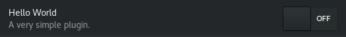

---
short-description: The plugin system, and a Hello World plugin
...

# Plugins

Pitivi's [Plugin Manager](https://gitlab.gnome.org/GNOME/pitivi/blob/master/pitivi/pluginmanager.py) is based on [libpeas](https://wiki.gnome.org/Projects/Libpeas). Currently we only support plugins written in Python 3.

## Location

There are two directories where Pitivi is looking for plugins. One is the system plugins directory, where normally you'll find the [plugins we ship by default](https://gitlab.gnome.org/GNOME/pitivi/blob/master/plugins). The other is the user plugins directory, where you can hack your own plugin.

Depending on how you installed Pitivi, these directories can have different locations. In the Plugins tab in the Preferences window you should be able to find out the location of the two directories.

## Hello World

Each plugin must have its own directory, so start with creating a directory, for example `hello`.

To provide some info about the plugin, create a [plugin info file](https://developer.gnome.org/libpeas/stable/PeasPluginInfo.html), for example `hello/world.plugin`:

```ini
[Plugin]
Name=Hello World
Description=A very simple plugin.
Authors=...
website=...
Copyright=...

Loader=python3
Module=world
```


The "Loader=python3" and "Module=world" above specify the plugin is loaded from the `hello/world.py` Python module. The module should contain at least one class implementing the [Peas.Activatable](https://lazka.github.io/pgi-docs/#Peas-1.0/classes/Activatable.html#Peas.Activatable) interface:

```python
from gi.repository import GObject
from gi.repository import Peas

class HelloWorld(GObject.Object, Peas.Activatable):

    object = GObject.Property(type=GObject.Object)

    def do_activate(self):
        print("Hello World!", self.object)

    def do_deactivate(self):
        print("Bye!")
```

Start Pitivi, activate the plugin in Preferences > Plugins, and notice "Hello World!" in the console.



## API

There is no API really. Plugins have full access to the entire app. Needless to
say, they will break sooner or later, as we refactor parts of the app. Use them
to have fun and try things out. If you think more people would be interested in
them, [talk with us](https://www.pitivi.org/contact/) to see what we can do to
help them survive.

The entire Pitivi instance is provided through `self.object.app` in the `do_activate` method:

```python
    def do_activate(self):
        # Keep a reference to the app so you can access later
        # the current project, for example.
        self.app = self.object.app

        # You can access the MainWindow to add your widgets, or
        # change the behavior of the existing widgets.
        main_window = self.app.gui
```

For an advanced example, check out how to create a plugin for [automating the operations with the clips in the timeline](Advanced_plugin.md).
