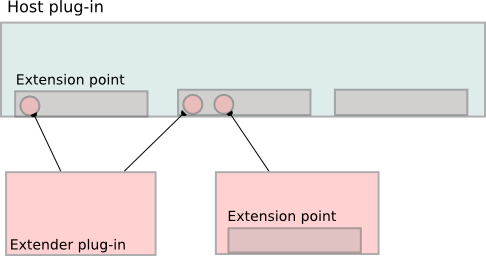

# Plugins

The PiTiVi plugin system will help keep the core to a minimum codebase
required for normal editing. The plugins will add various kind of
functionalities/interfaces for new features, special hardwares, online
services, ....

# Use Cases for Plugins

This is a list of use cases for plugins so we can figure out what are
the various categories of plugins we will need.

-   Istanbul controller : To be able to do screen-grabs that can then be
    edited within pitivi
-   YouTube uploader : uploading projects to YouTube
-   3rd party effects : provides higher-level effects re-using existing
    GStreamer elements. (optional) can provide a specific UI.
-   UI-only plugins : provide a different user interface to manipulate
    the timeline for specific tasks (compositing-specific view for
    example)
-   Specific hardware integration
-   image sequence loader : So you can load a sequence of image files
    and use that as a source in the timeline.
-   **Put your ideas here...**

# Case Studies

Here we analyze some pluggable architecture implemented by other
opensource projects in order to focus their strength/weak points in
relation to pitivi's needs. The list here does not pretend at all to be
exaustive but is only meant to provide a cheap guided tour of the
neighbourhood.

## The Deluge way

Deluge is a bittorrent client written in python+gtk
(http://www.deluge-torrent.org), it provides one of the most simple
implementation of a pluggable architecture:

Plugins are stored in subdirectories of the ./plugin path. Each
subdirectory takes the name of the contained plugin. Each plugin should
at least provide an \_\_init\_\_.py file which defines the custom
namespace and provides the access points for the plugin.

Inside the \_\_init\_\_.py are stored:

-   Description fields (plugin's name, author, version and description)
-   deluge\_init() function is called to initialize the plugin
-   enable() function is called when the user enables the plugin

The plugin manager scans the plugin directory for new items and when a
plugin is found, it imports the namespace into the list of plugins and
calls the deluge\_init() function to initialize the plugin.

This implementation has the major advantage of being lightweight.

It does not create a class hierarchy for plugins: this can be both an
advantage and an handicap since changes in the common base plugin class
would potentially break plugin's compatibility but having a common
ancestor can simplify usual operation by defining them inside the
ancestor.

It is not possible to categorize plugins, even if a simple “category”
field inside the \_\_init\_\_.py would be enough.

This plugin architecture is useful for extending the application with
functionality not considered in the core objects, since the plugin has
full control over the application and can thus extend any aspect of the
host.

## The Jokosher way

Jokosher is an audio production software that uses python+gtk+gstreamer
(http://www.jokosher.org)

Its pluggable architecture places plugins into the ./extensions
directory. Plugins can be stored as source .py files or packed into
python eggs.

Extension API are provided for inserting menu items inside the main
jokosher menu, as well as functions to control playback, instruments and
to add new output formats.

Plugin preferences are stored in the ./extension-config path, with one
config file for each plugin named as the plugin itself. Preferences are
serialized by pickle into a dictionary of objects; standard methods to
store and retrieve keys from the dictionary are available to the plugin
writer.

The plugin manager install/remove plugins taking care of possible
conflicts, it also manages the loading/unloading/configuration processes
for each plugin, ensuring each plugin is loaded only once (plugins are
treated as singletons).

Each plugin must contain:

-   some descriptive fields identifying the name, description and
    version
-   startup(api) function is called when the plugin is activated,
    passing the whole API set to the the plugin.
-   shutdown() function is called when the plugin is deactivated, it
    takes care of the cleanings.

This approach defines a clear set of API that the plugin can use as
preferred way to interact with the main application, API are pushed into
the plugin when it is activated and a reference to them is usually kept
inside the plugin though all its lifetime.

API for UI integration allow to insert new menu items, leaving to the
plugin the responsibility to remove the inserted items when it is
unloaded. The same logic is applied when additional output formats are
provided by the plugin, those must be removed from available output
format by the plugin itself when it is deactivated.

Strength points of the Jokosher approach are a well designed and
lightweight plugin manager; the possibility to store plugins in python
eggs that simplifies a lot the deployment of new plugins; a clean set of
API the plugin can use to interact with the host application; the
possibility to add new output formats; the possibility to save plugin's
preferences without having the plugin care about serialization
procedures.

Weak points of this architecture are a limited UI integration because
plugins which uses only the API can insert menu items only under the
“plugin” submenu; the creation of a preferences file for each plugin
available could lead to a pollution of config files; leaving to plugins
the duty of removing UI enhancements they inserted could lead to waste
of memory if the plugin writer does not make a good job, a defaulf
approach for cleaning would be preferable.

## The Trac way

Trac is an enhanced wiki and issue tracking system for software
development projects (http://trac.edgewall.org/), it has a consistent
pluggable architecture that it strikingly rensembles the one of the
Eclipse framework:

The main application exposes some entry points where plugin can plug
into. each entry point is characterized by a contract that both the
plugin and the main application must subscrive in order to interact;
this contract takes the concrete form of an interface declared by the
main application and implemented by the plugin.

Each plugin can implement multiple interfaces, in this way it extends
multiple aspects of the main application.

Each entry point can be plugged by multiple plugins, thus the same
feature of the main application can be extended in multiple ways.

Plugins can expose entry points themself, allowing them to be extended
by other plugins.

Trac plugins inherits from the “Component” class and are deployed as
python eggs.

The whole application is designed to be modular and plugins can also be
created to replace built-in components.

Technically, the most of the work is done in the core.py file which
declares the following structures:

-   Interface class, defines the ancestor of all interfaces implemented
    by plugins using the implements() function
-   ExtensionPoint class, defines each single extension point slot,
    characterized by an Interface that every component who wants to plug
    must conform.
-   Component class, defines the generical component boundled to an
    exinsing component manager
-   ComponentManager class, manages all the components available to the
    application, switching them on/off and taking care each component is
    a singleton.

Trac approach intruces a simple implementation for interfaces in python,
an example code of how this architecture is used for creating plugins is
reported in the following example (taken from Trac documentation):

```
from trac.core import *

class ITodoObserver(Interface):

    def todo_added(name, description):
    """Called when a to-do item is added."""

class TodoList(Component):

    observers = ExtensionPoint(ITodoObserver)

    def __init__(self):
        self.todos = {}

    def add(self, name, description):
        assert not name in self.todos, 'To-do already in list'
        self.todos[name] = description
        for observer in self.observers:
            observer.todo_added(name, description)

class TodoPrinter(Component):
    implements(ITodoObserver)

    def todo_added(self, name, description):
        print 'TODO:', name
        print '     ', description
```

ITodoObserver interface provides a todo\_added() callback to trigger
plugin's functionalities.

The class TodoList is declared as expandable by declaring an extension
point, used by plugins that implements the ITodoObserver interface.

Finally an example plugin TodoPrinter is written that extends the
TodoList by implementing the interface ITodoObserver via the
implements() function.

## The Zope way

Since version 3.0 the CMS engine Zope (http://www.zope.org) introduced a
full fledged interface implementation in python, as core system for its
pluggable architecture.

In python the concept of interfaces, intended as a formal way to define
relationships between items, does not yet exist; instead duck typing is
the generally utilized way, so if an object hasattr(foo, 'bar') then
foo.bar(), but this approach goes so far, since it is not possible to
determine if an attribute is callable or has constrains to its possible
values.

In fact plugin developers must rely over documentation to check what
methods their classes have to provide to implement a certain feature,
and this approach is very prone to broke plugins compatibility if
documentation is not kept perfectly synchronized with the code.

Zope interfaces are designed to be applied not only to classes, but also
to modules, objects and functions, since they follow the golden rule
that “specification should make no assumption about implementation”;
this approach leaves complete freedom to the plugin developer to
organize its code in the way it prefers, as long the intefrace
requirements are fulfilled; in this way duck typing gets formalized
without adding a big overhead.

```
from zope.interface import Interface, implements,  providedBy

class ISing(Interface):
   def sing():
       """Returns a melody"""

class Sinatra(object):
   implements(ISing)

   def sing(self):
       return "In singing in the rain..."

frank = Sinatra()
ISing.providedBy(frank)    <-- True
```

Interfaces fully supports inheritance from other interfaces (with the
security check that children's methods conforms to ancestor's one if
overridden), implementer of an interface hierarchy can limit the
implementation only to a certain child interface in the lineage; the
status of interface implementer can be attached at runtime to items that
do not explicitly implemented the interface in their definition; as
well the implementer status can be removed from an item at runtime
(useful for example in containers that implement an interface by
delegating implementation to contained objects).

The other big feature of Zope interfaces is that they can be used to
create adapters in a very efficient way, providing also a centralized
registry for adapters.

## Considerations

These case studies exemplify two different approaches for extending the
host application:

In the first two cases (Deluge and Jokosher) the host application
basically defines a plugin manager that takes care of activating and
deactivating plugins; when activated, the plugin is allowed to access
the core objects and modify the application as it wants.

This approach has the advantage to leave complete freedom to plugins at
the cost of anarchy, since there isn't a standardized way for the plugin
to interact with the host application. Jokosher tries to overcome this
situation by defining some API that can be optionally used by plugins to
accomplish common tasks. The other big advantage is that plugins can be
created to extend aspect of the application not considered originally by
the author to be extendable.

In the third case study (Trac), as opposite, plugins can only extend
specific aspects of the host application defined as extension points,
whose declare a clear contract the plugin must subscrive if it wants to
extend the host application.

This approach enforces a neat definition of rights and duties for the
partiecipants to the extension process at the cost of some freedom. In
this way plugins do not “put” their features into the application, but
“offer” instead some extended features the application can use.

The last case study (Zope) further improves the concept of interfaces,
adding the possibility to define attributes/constrains inside
interfaces, providing functions to check interface
implementation/definition, adding a complete facility to provide
adapters; all this is done in the pythonic way of leaving the developer
the most freedom.

The main advantage of using interfaces over class inheritance is that
the former defines relationships between items and keeps the system
highly decoupled, while the latter constrains thee partecipants to a gree
an “is a” relationship, thus creating strong coupling between classes.

# Pluggable architecture proposal

In the light of needed use cases and analyzed case studies the following
hybrid pluggable architecture is proposed for Pitivi.

## Nomeclature

From here on, we will use the term “extension point” to define an aspect
of the main application which can be extended by plugins. In respect to
extension point we'll define “host” the component (usually pitivi but
also plugins can be extended) that exposes the extension point, and
“extender” the component that plugs into the extension point in order to
provide additional features to the host component. Every extension point
is characterized by a contract that both the parts must subscrive in
order to interact.

## Plugin deployment

Since simple plugins may consist of a single python file, while complex
plugins may comprise glade interfaces, code written in other languages,
graphics etc.. etc.. then plugins needs to be packed.

A convenient method is to take advantage of python eggs
(http://peak.telecommunity.com/DevCenter/PythonEggs) and create an .egg
file for each plugin. Eggs are similar to java's jar files, they make
very simple the shipping and installation of new plugins since all you
need is to drag the .egg file inside the ./plugins directory. Eggs also
ships a standard method for exposing plugin's entry points and
dependencies, making easy to allow cooperation/subordination among
plugins.

we can expect pitivi to be shipped with some default plugins available
for all the users and meant to be uninstalled by the system
administrator only; while it is also auspicable to let users install
custom plugins and encourage them in writing new ones.

Default plugins could be placed inside the pitivi installation path (i.e
/usr/local/pitivi/plugins), these plugins are usually installed by the
linux distribution facility and only users with root privileges can
modify them directly.

User plugins could be placed inside the user home directory (i.e. in
/home/my\_user/.pitivi/plugins) and can be installed/deleted/modified by
the user.

Pitivi should check for both the locations when searching for available
plugins, and should use the user home to store plugin configuration
parameters (i.e /home/my\_user/.pitivi/plugin-settings).

## The extension act

The relationship that exists between extension points and plugins is
schematized in this cartoon:



1.  Each plugin may act as extender and as host by exposing extension
    point itself.
2.  Each host may have many extension points.
3.  Each extension point may be extended by multiple extenders.
4.  Each extender may extend multiple extension points.

In order to plug into the extension point the extender component must
conform a protocol declared by the host component; this intefrace
specifies function signatures for the duties that host component is
planned to demand to plugin, like callbacks for occurred events, widgets
to integrate into the user interface or implementation of common
operations over new file formats.

Each extension point should be able to keep a list of extenders plugged
in, providing to the host component a convenient way for trasversing
extenders.

## Direct core objects access

For those plugin which wants to extend aspects of the application not
exposing extension points, core objects of the host application can be
manipulated directly by the plugin writer. Since in python classes does
not encforce information hiding concepts, the plugin writer can easily
access them and inject the new features.

In order to allow the plugin this alternative extension approach, the
plugin writer will insert new features when the plugin is activated by
the plugin manager, and provide a complete cleaning of plugged features
when the plugin is deactivated.

## Plugin manager

The plugin manager is the orchestra director, its duties comprise:

1.  Keep track of available plugins
2.  Install/Remove plugins
3.  Activate/deactivate plugins
4.  Provide facilities to store and retrieve plugin's preferences
5.  Retrieve plugins from the pools on a category search criterium
6.  Resolve versioning conflicts and incompatibilities among plugins

# Use cases for plugin manager

## Install a new plugin

For a generic plugin the user:

1.  Open the plugins list window
2.  Drags&drop the new plugin's package inside the list of plugins

For an effect/transition the user:

1.  Selects the effects list
2.  Drag&drop the effect plugin inside the list of available effects

The plugin manager backend:

1.  Catch the drop of items inside the plugin list
2.  Check the item dropped is really a plugin compatible with the
    current version of the application
3.  Check if the plugin requires other plugins to be installed, stop if
    those are not present
4.  Copy the package inside the user plugin directory
5.  register the plugin among the pool of available plugins
6.  If there are plugins requiring the installed one to work, make them
    activable by the user
7.  Update the plugin/effect/transition list

## Uninstall a custom plugin

The user:

1.  Drag&drop the plugin from the list of plugins to the trash

The plugin manager backend:

1.  Catch the drop of a plugin from the list to the trash
2.  Check for plugins that depends upon this one, and ask the user if he
    wants to cancel the operation or proceed anyway
3.  Deactivate the plugin if active
4.  Unregister the plugin from the pool of available plugins
5.  Remove the plugin package
6.  Disable plugins whose require the trashed plugin to be activated
7.  Make plugin whose require the trashed plugin unactivable by the user
8.  Update the plugin/effect/transition list

## Upgrade an existent plugin

The user:

1.  Drag&drop the new version of the plugin into the list of plugins

The plugin manager:

1.  Check the plugin pool for duplicates of the plugin to be installed
2.  Ensure the version of the dropped plugin is newer than the current's,
    otherwise prompt the user for confirmation
3.  Remove the old plugin, preserving configuration items
4.  Install the new plugin

## Configure a plugin

The user:

1.  Open the plugin manager window
2.  Select the plugin to configure
3.  Press the “Configure” button to show the configuration dialog.

The plugin manager:

1.  Ask the plugin for the configuration dialog.
2.  Retrieve from the plugin configuration file the dictionary of config
    values belonging to the plugin
3.  Pass the plugin the dictionary
4.  The plugin updates the dictionary passed by the plugin manager
5.  Save the dictionary in the file containing plugin configuration

## Enable/Disable a plugin

The user:

1.  Open the plugin manager window
2.  Check/Unckeck the plugin

The plugin manager:

1.  Load/unload the plugin
2.  Refresh the user interface if plugin extended it

# Design

## UI integration

Extending the user interface could be achieved in basically two ways in
GTK:

The first is writing custom code to integrate new widgets provided by
the plugin into the current user interface design.

The second way is taking advantage of the UImanager component provided
by gtk, this facility allow the developer to define UI widgets as xml
then the UImanager can be told to merge the xml code into the existing
GUI. Even thought this approach requires the plugin writer to learn
UImanager xml syntax, the process clearly separate the UI creation part
from the definition of actions triggered by the new UI piece, so it'll
be preferred to the former approach when possible.

Despite of the type of widget integrated in the main user interface the
following interface definitions will provide methods with a “UI” suffix
meant to provide to the UImanager the xml code to integrate inside the
main user interface, and other methods with the suffix “Action” meant to
provide to the main application actions to bind to the main UI widgets.

Plugins must conform to the following protocol if they want to extend
pitivi UI, in change pitivi is obliged to integrate the widgets provided
by plugins in the way plugins define, with the freedom to choose when
it's time to integrate them (usually when the main user interface is
built at application startup or when user choose to activate the
plugin).

## Menu / Toolbar integration

Placing a menu item or a tool button is the simplest way a plugin can
interact with the user, the following interfaces provide convenient ways
for the plugin to integrate widgets in the main user interface:

Class IMenuProvider(Interface):

```
def getUI():
    """Return the xml code defining the user interface enhancement"""

def getActions():
    """Return the list of actions triggered by new menuitems"""
```

## Additional source providers

This kind of plugins provides items user can drag into the timeline such
as videoclips, effects, transitions. Pitivi inserts a new tab in the
sources notebook displayed in the top-left portion of the main window.
Plugins that want to be source providers must implement the following
interface:

Class ISourceProvider(Interface):

```
def getName():
    """Return the name to be displayed in the notebook tab title"""
def getWidget():
    """Return the source view widget, usually a gtk box"""
def getCallbacks():
    """Return a tuple of (cb_name, signal_name) in the order they must be connected"
```

Note on signals handling: the plugin may provide callbacks to observe
application signals, they're retrieved from the plugin with the
getCallbacks() method, the returned tuple is coonnected to host
application signals in the order specified by the plugin, and
disconnected in reverse order when the plugin is deactivated.

## Recording devices

Recording devices such as webcams, microphones but also unconventional
items like screencast share the same requirements to be used by Pitivi:

```
class IRecordingDevice(Interface):
    __gsignals__ =
    {
    "recording-started": (gobject.SIGNAL_RUN_LAST, gobject.TYPE_VOID, ()),
    "recording-finished": (gobject.SIGNAL_RUN_LAST, gobject.TYPE_PYOBJECT, ())
    }
    """recording-started informs observers the device started recording.
       recording-finished signals the main application that a new clip is produced by the device,
       the clip uri is returned by the signal in order to be added among
       sources """

    def getName():
        """Return the name of the device"""
    def hasVideo():
        """Return true if device can provide video"""
    def hasAudio():
        """Return true if device can provide audio"""
    def record():
        """Start recording"""
    def stop():
        """Stop recording"""
    def isRecording():
        """Returns true if the device is currently recording"""
```

## Effects/Transitions

This kind of items represent an exception to the general concept of
plugin, which are usually meant to be singletons by definition (only a
single object for each plugin is created by the application), since
they're made to be applied more than one time over the timeline.

Effects/Transitions are collected and exposed to the user as a list,
grouped into functional categories. This task will be accomplished by a
specialized SourceProvider plugin called Effect(Transition)Provider,
exposing entry points where Effects can be inserted. The Provider takes
also care of creating a new effect object every time the user drags the
effect to the timeline, thus implementing the Factory design pattern.

Every Effect object life-cycle starts in the moment the user drags it
into the timeline and ends when its is removed, during its lifetime the
object stores its custom preferencies in memory, while default
preferences are stored in the same way of preferences of other plugins.

Detailed discussion of Effects/Transitions architecture will be
discussed in a separate design document.

# Links

Various links for inspiration...

## Other python plugin systems

-   <http://trac.edgewall.org/wiki/TracDev/ComponentArchitecture>
-   <http://trac-hacks.org/wiki/EggCookingTutorial/BasicEggCooking>
-   <http://live.gnome.org/Gedit/PythonPluginHowTo>
-   <http://jokosher.python-hosting.com/wiki/ExtensionSystem>
-   <http://twistedmatrix.com/projects/core/documentation/howto/plugin.html>
-   <http://termie.pbwiki.com/SprinklesPy>
-   <http://docs.turbogears.org/1.0/TemplatePlugins>
-   <http://www.zope.org>

## Other non-python plugin systems

-   <http://www.eclipse.org/articles/Article-Plug-in-architecture/plugin_architecture.html>
-   <http://www.codeproject.com/csharp/C__Plugin_Architecture.asp>
-   <http://www.codeproject.com/dotnet/PluginManagerClassBrk.asp>
-   <http://www.objectplanet.com/opinio/userguide/index.htm?page=plugin_architecture.html>
-   <http://developer.mozilla.org/en/docs/Plugin_Architecture>
-   <http://sync4jmozilla.sourceforge.net/Mozilla%20PIM%20Plugin%20Design%20Document.pdf>
-   <http://www.gnome.org/projects/epiphany/documentation/extensions/>
